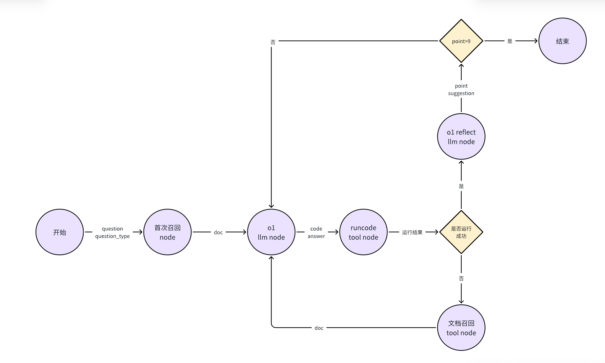

# 方法说明

主要采用Reflexion自我反思框架

具体实现见如下的工作流图，我们把各个agent封装成了一个个节点，通过一个State在里面传输来进行数据的传输和流程的控制

使用agents/__ init __.py中的CustomAgent来控制整个工作流

采用三路合并的方法来增强模型的效果

主要推理模型采用的是openai最新的o1模型，替代了原来的COT+ReAct推理框架，大量节省了时间，且推理效果较好，其他节点需要使用llm的部分均采用gpt4o（文档召回部分使用的是gpt4o-mini，为了节省一下成本）

对每次生成的代码都进行了测试，确保每个代码都能正确运行并且保证了answer的正确，如果出现运行错误则根据错误提示再次召回代码重新作答



# 代码架构

app

｜--agents # agents代码  
-----L--__ init __.py agents # 初始化代码和主agent工作流定义  
-----L--base.py # 基础模型调用和状态初始化  
-----L--coderunner.py # 代码运行节点  
-----L--doc_retriever.py # 文档召回节点  
-----L--o1_reflection.py # 反思节点  
-----L--o1chat # 答案生成节点  
-----L--subproblem # 子问题提取节点（未启用）  
｜--answer # 运行结果  
｜--config # 配置  
｜--question # 数据集  
｜--log # 运行日志  
｜--knowledge_base # 知识库  
｜--prompt # Agent提示词  
｜--work # 工作空间（用于手动缓存部分文件）  
｜--耗材 # 用于存放进行三路合并的答案  
｜--备份 # 运行结果备份  
｜--tools # 可以被Agent调用的工具  
-----L--__init __.py # 把函数封装成工具并且初始化tool类  
-----L--code_interpreter.py # 代码执行函数  
-----L--query_engine.py  # 文档召回函数  
-----L--utils.py # 一些经常会被调用的函数，例如获取llm  
｜--storage.ipynb # 文档向量化模块  
｜--main.ipynb # 主程序运行模块  
｜--load_storage.ipynb # 文档召回测试文件  
｜--清理.ipynb # 用于清理多次运行未得到正确答案的题目  
｜--hb.ipynb # 三路结果合并程序  
｜--environment.yml # conda环境配置文件  

其他文件均为测试时所使用的文件，可以忽略

# 数据集

仅使用了官方提供的文档数据集  

详情可见question文件夹  

# 模块说明

## 代码执行器模块

采用subprocess.run来同步运行子进程，详情可见tools/code_interpreter.py  

## 文档召回模块

文档搜索采用的是向量召回，主要使用的是llamaindex的查询引擎，具体可见tools\query_engine.py内的create_query_engine函数  

question文件夹仅包含了官方提供的数据集  

通过storage.ipynb文件对官方提供的文档进行向量化，采用chromadb进行向量存储  

可以使用load_storage.ipynb测试向量能否被正常加载  

## 自我反思模块

采用o1对之前生成的answer和code进行反思并给出分数和建议，具体实现可见agents\o1_reflection.py，该模块可以被单独调用，只需初始化state里的  

question,qes_type,answer,code然后把他传入O1Reflection即可  

# 使用说明

使用main.ipynb进行运行即可，通过修改int(row['ID'])<=256and int(row['ID'])>0可以控制执行题目的范围，但是注意要把初始题目放在answer文件夹内  

每次运行后可以观察answer文件夹内的运行结果，如果"is_verify": "False"较多需要使用清理.ipynb对这部分进行一下清理，main.ipynb只会对answer为空的题目进行运行  

运行三次后结果保存到耗材文件夹内，然后使用hb.ipynb对三次结果进行投票合并得到最终的结果  

# 环境搭建

1.先加载conda运行环境，默认环境名为SMP，python版本为3.10.14  

```
conda env create -f environment.yml  
```

2.在config文件夹的base.py文件内配置程序的路径，例如'D:/LLM/比赛/SMP/app'，在model_config.py内配置需要用到的模型的apikey  

3.使用storage.ipynb文件对文档进行向量化  

# 小广告

本方案需要使用大量的token切需要采用4o和o1等openai模型  

openai api国内转发 

<<<<<<< HEAD
[CianAPI](http://14.103.169.119:3000)

便宜稳定，4元一刀，量大优惠可谈，可以提供一定的技术指导
=======
[CianAPI](http://14.103.169.119:3000)  

便宜稳定，4元一刀，量大优惠可谈，可以提供一定的技术指导  
>>>>>>> 229570ec837d458d64b6761a3e0410f3bb4e681c

添加管理员联系方式可以领取3刀的测试额度
